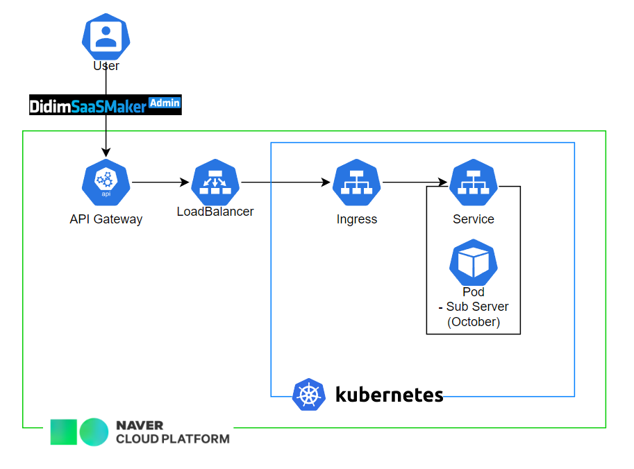

## october
> Creator: swhong
> Date: 2022/12/7

## Description
* SaaS Maker라는 외부 서비스와의 연동을 위해 만들어진 REST API 서버입니다.
* ncloud K8S 환경에서 사용하고 있습니다.
  * ncloud 의 Source Commit (git), Source Build, Source Deploy 를 이용해 
  CI / CD pipeline 을 구축해 빌드 및 배포 되고 있습니다.
* API 의 사용 인증
  * getToken API 에 지정된 service key 와 secret key 를 보내 jwt token 를 생성하고
  * header - Authorization 파라메터에 jwt 토큰을 담아 보내 사용 인증을 받습니다.

## 구성도

## Environment
* Node.js  ver.16.17.1
* DB : Cubrid
* Log : Winston
* 인증 : JWT

 
## 프로젝트 구조
* API 호출이 오면 route -> controller -> service 순서로 응답을 처리합니다.
```
 October
    │  app.js       : node.js 실행파일
    │  deploy.yaml  : kubernetes 용 배포 파일
    │  Dockerfile   : 도커 이미지 생성용 설정 파일
    │  logger.js    : 로그 출력 유틸리티
    ├─common        : Static 변수 
    ├─controllers   : 각 API 컨트롤러 
    ├─cubrid        : Cubrid DB Connect Manager
    ├─models        : API 데이터 모델, DAO
    ├─http          : http 통신 모듈
    ├─oauth         : Access Token 생성 유틸
    ├─services      : 서비스 로직 
    └─utils         : 유틸리티
        
 ```